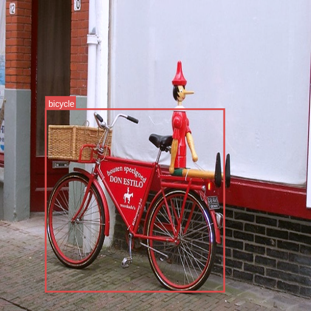
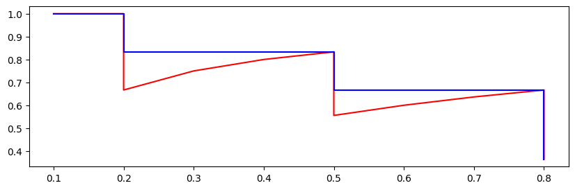

### Weakly supervised detection network

In this project, we train a deep neural network to detect objects and create bounding boxes WITHOUT providing bounding boxes as labels. For each training image, just the existence of each of the 20 classes is provided. This method is 'weakly supervised' in this sense.

For the backbone, we use the first 5 convolutional layers of pretrained Alexnet. 
The classifier model is my pytorch implementation of a simplified version of WSDNN from paper:

[1]
Bilen, Hakan, and Andrea Vedaldi.**"Weakly supervised deep detection networks."**  Proceedings of the IEEE conference on computer vision and pattern recognition. 2016.
___

Components

- WSDDN.py

    - uses pre-trained AlexNet's feature extraction layers
    - ROI's pre-extracted by selective search.
    - experiments with ROI_pooling/SPP

- SPP?
    
    - Spatial Pyramid Pooling
    - Max pool operation on each ROI, with different window size
    - concatenates results with different scale factors

The default sizes for each floor of the pyramid are set to [4x4, 2x2, 1x1]. 


### Samples after training 6 epochs(~20minutes)




view more here: [wandb](https://wandb.ai/cvl2023/weakly%20supervised%20deep%20detection%20network/runs/q5am68a4?workspace=user-khjune29)

```
WSDDN(
  (features): Sequential(
    (0): Conv2d(3, 64, kernel_size=(11, 11), stride=(4, 4), padding=(2, 2))
    (1): ReLU(inplace=True)
    (2): MaxPool2d(kernel_size=3, stride=2, padding=0, dilation=1, ceil_mode=False)
    (3): Conv2d(64, 192, kernel_size=(5, 5), stride=(1, 1), padding=(2, 2))
    (4): ReLU(inplace=True)
    (5): MaxPool2d(kernel_size=3, stride=2, padding=0, dilation=1, ceil_mode=False)
    (6): Conv2d(192, 384, kernel_size=(3, 3), stride=(1, 1), padding=(1, 1))
    (7): ReLU(inplace=True)
    (8): Conv2d(384, 256, kernel_size=(3, 3), stride=(1, 1), padding=(1, 1))
    (9): ReLU(inplace=True)
    (10): Conv2d(256, 256, kernel_size=(3, 3), stride=(1, 1), padding=(1, 1))
    (11): ReLU(inplace=True)
  )
  (classifier): Sequential(
    (0): Linear(in_features=5376, out_features=1344, bias=True)
    (1): ReLU(inplace=True)
    (2): Linear(in_features=1344, out_features=256, bias=True)
    (3): ReLU(inplace=True)
  )
  (score_fc): Linear(in_features=256, out_features=20, bias=True)
  (bbox_fc): Linear(in_features=256, out_features=20, bias=True)
)
```

### class-wise mAP calculation
- multi-class detection scores

    - combined result of classification/detection heads for all region proposals give a per-image score

    - 0~1 score for each class, 1 means existence of that class in the image.

    - the score do not sum up to 1, because there may be multiple classes in one image

- implementation of mAP:
https://jonathan-hui.medium.com/map-mean-average-precision-for-object-detection-45c121a31173
from this site, interpolated AP for 20 points was used.


___
skeleton from CMU's Visual Learning course, but modified