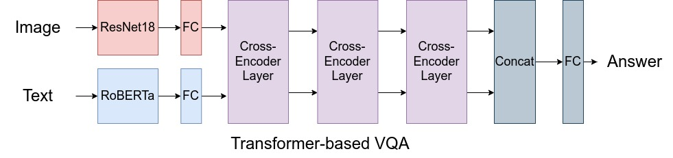

This is a sample submission for **CMU Visual Learning class(2022)**.
Skeleton code is provided by the TAs, and the network architecture is also provided. Implementation and training is done by me.

## Task Description

### the MSCOCO dataset
이 데이터셋은 각 이미지에 대한 몇개의 질문과, 각 질문에 대한 10개의 답으로 구성된 데이터셋입니다. 10개의 답은 모두 paraphrase거나 비슷하게 말이 되는 답들로 구성되어 있습니다.

문답의 예시는 아래와 같습니다. 

각 이미지에 대해,

**Q1.** What color is the floor? \
**A1-1.** brown. wood colored

**Q2.** How many animals are in the picture? \
**A2.** 2

**Q3.** Is this a child room? \
**A3.** Yes

## Training

We treat the QA problem as a multi-class classification problem, using 5217 most common answers as classes. Using 3 layers of cross attention, we capture both modalities. Pretrained BERT model and resnet model are used for extracting textual and visual content, respectively.

There is a special 'Other' class, which occurs a bit too frequently, and I'm working on a fix.

Here's a wandb log of training samples after 3 epochs. Just after 3 epochs, training accuracy reaches 67%. On laptop GPU(RTX3080), each epoch takes about 5~10 minutes. trained for 100 epochs.

