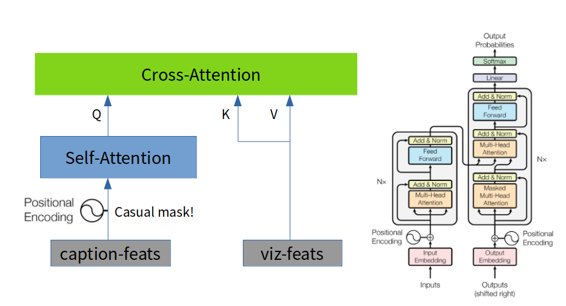
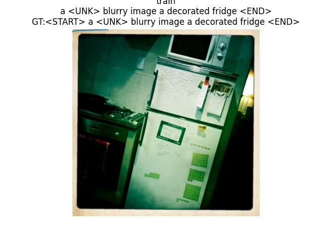
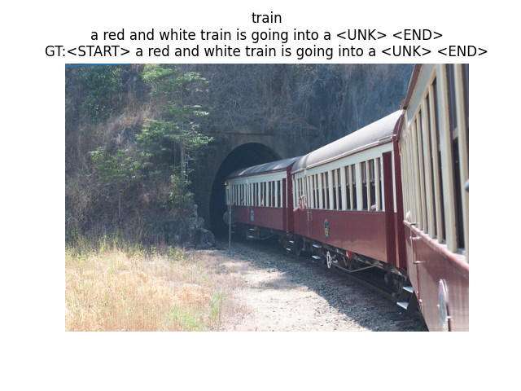
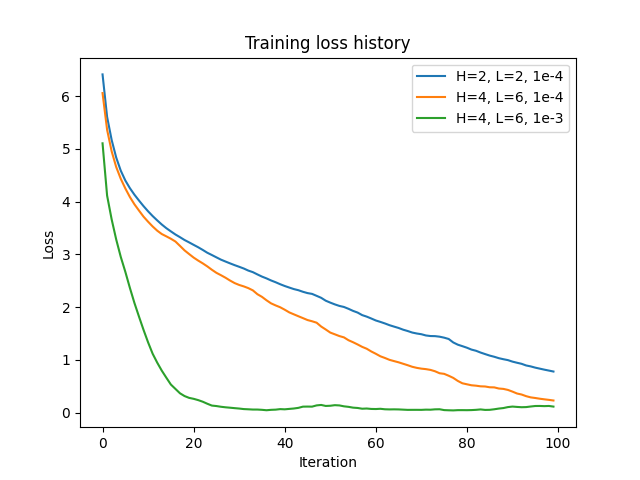
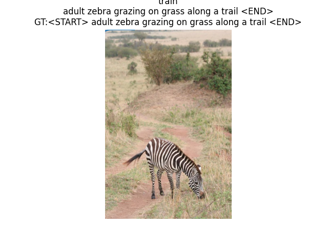

This is a sample submission for **CMU Visual Learning class(2022)**.
Skeleton code is provided by the TAs, and the network architecture + greedy decoding is also provided. My work is the implementation of the transformer and training.

## Implementation

### The transformer decoder
The image captioning transformer consists of an image encoder and a transformer decoder.

The encoder is a VGG16 model, features taken from FC7 layer. (we don't train this..)

The decoder is a stack of decoder layers, which consists of **masked self attention** followed by **cross attention** which merges visual information.\
Both attention layers are **multi-headed**:\
 QKV are split into smaller dimension, scaled dot-product attention is calculated for each set, and merged together.

image contains figure from 'Attention Is All You Need' paper.

## Results and Discussion

### Captioning task

trained on COCO captioning dataset. vocab size of 1004. GT captions contain  \<UNK\> tokens. Here's a summary of results, varying the number of num_heads and num_layers. 

| num_heads | num_layers | best loss | sample |
| --- | --- | --- | --- |
| 2 | 2 | 0.78 | |
| 4 | 6 | 0.23 | |

Training curve, 100 epochs (~5 minutes on RTX3080). The loss is computed for **training** set: since we are training on a small subset of COCO, don't expect good performance on valid set. :cry:

### Changing the learning rate

this time we fix num_heads = 4, num_layers = 6,
and then tweak the learning rate.

| lr  | best loss | sample |
| --- | --- | --- |
| 1.0E-4 | 0.23 | |
| 1.0E-3 | 0.04 | |

increasing the learning rate led to better performance with the bigger model.