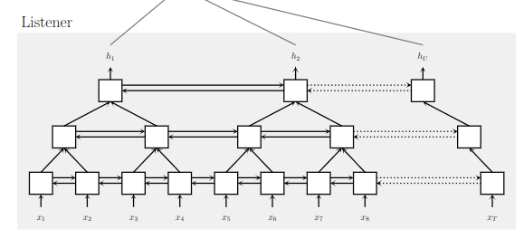
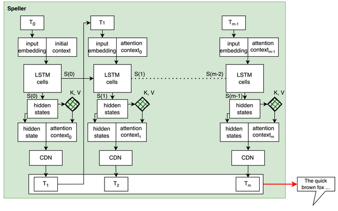

## ASRModel:
pBLSTM encoder + simple MLP Decoder

```
ASRModel_Attention(
  (listener): Encoder(
    (embedding): Sequential(
      (0): Conv1d(28, 64, kernel_size=(3,), stride=(1,), padding=(1,))
      (1): BatchNorm1d(64, eps=1e-05, momentum=0.1, affine=True, track_running_stats=True)
      (2): ReLU()
      (3): ResidualBlock(
        (conv1): Conv1d(64, 64, kernel_size=(3,), stride=(1,), padding=(1,))
        (bn1): BatchNorm1d(64, eps=1e-05, momentum=0.1, affine=True, track_running_stats=True)
        (activ1): ReLU()
        (conv2): Conv1d(64, 64, kernel_size=(3,), stride=(1,), padding=(1,))
        (bn2): BatchNorm1d(64, eps=1e-05, momentum=0.1, affine=True, track_running_stats=True)
        (activ2): ReLU()
      )
    )
    (lstm): LSTM(64, 64, bidirectional=True)
    (pBLSTMs): Sequential(
      (0): pBLSTM(
        (blstm): LSTM(256, 64, bidirectional=True)
      )
      (1): LockedDropout()
      (2): pBLSTM(
        (blstm): LSTM(256, 64, bidirectional=True)
      )
    )
  )
  (attend): DotProductAttention(
    (query_proj): Linear(in_features=64, out_features=64, bias=True)
    (key_proj): Linear(in_features=128, out_features=64, bias=True)
    (value_proj): Linear(in_features=128, out_features=64, bias=True)
    (dropout): Dropout(p=0.1, inplace=False)
  )
  (speller): AttentionDecoder(
    (attend): DotProductAttention(
      (query_proj): Linear(in_features=64, out_features=64, bias=True)
      (key_proj): Linear(in_features=128, out_features=64, bias=True)
      (value_proj): Linear(in_features=128, out_features=64, bias=True)
      (dropout): Dropout(p=0.1, inplace=False)
    )
    (embedding): Embedding(31, 64)
    (lstm_cell1): LSTMCell(64, 64)
    (lstm_cell2): LSTMCell(64, 64)
    (softmax): LogSoftmax(dim=-1)
    (CDN): Sequential(
      (0): Linear(in_features=128, out_features=64, bias=True)
      (1): Dropout(p=0.1, inplace=False)
      (2): ReLU()
      (3): Linear(in_features=64, out_features=31, bias=True)
    )
  )
)>
```
### Listen

The listener consists of an embedding layer and several pblstm layers. The embedding layer is a convolution which embeds 27-dim mfcc to a higher feature dimension. The inputs can be very long in time dimension. The pblstm layer concatenates consecutive steps from the input, effectively reducing the timesteps by half for each layer. The listener uses 2~3 pblstm layers, so the encoded features are 4~8 times shorter than the input sequence.



### Attend and Spell

The attender, at each timestep, attends to different portions of the encoding. Each portion of the encoding represents a time slice of audio features. The attention weights are computed from the speller's state as queries and the encoder features as keys.

The speller consists of a LSTM + output MLP. At each timestep, the output phoneme from the previous timestep is fed to the LSTM as next input. LSTM's output(hidden states) + attention context calculated by the attender are passed through the output MLP. The output MLP outputs a probability distribution over the phonemes, hence dubbed CDN(character distribution network). The speller draws a phoneme from this distribution.


image adopted from CMU 11-785 Deep Learning course HW4pt2 handout

