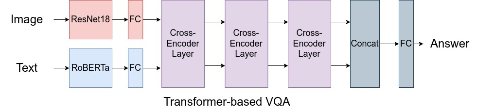
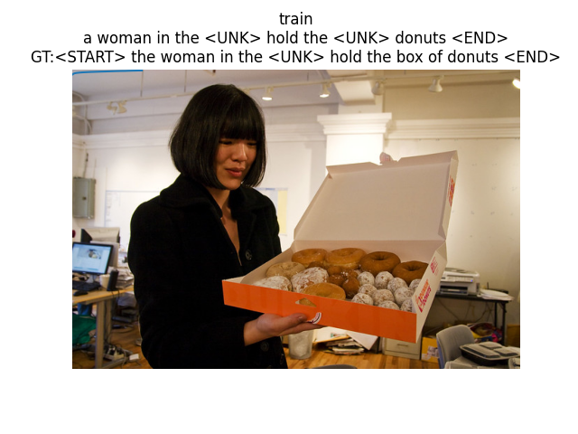

## Computer Vision and Visual Learning 2023

This repository contains starter code for completeing coding assignments.
Refer to below and the READMEs in each folder for details. (check for updates)

### Lab 1. Weakly Supervised Learning [(Link)](https://visual-learning.cs.cmu.edu/f22/hw1.html)

*OUT: 11월 01일 수요일*

*DUE: 11월 14일 화요일 23:59*

We will write and train object detectors with only image-level class labels and without the bounding box annotations. 

Please refer to Week 11 of [this](https://visual-learning.cs.cmu.edu/f22/schedule.html) course for reading materials.

### Lab 2.Visual QA with Cross-Attention [(Link)](https://github.com/visual-learning/vqa)

*OUT: 12월 30일 수요일*

*DUE: 01월 07일 일요일 23:59*

Using cross-attention, we train on a visual QA task combining textual features from BERT and visual features from resnet. Then, we train on larger, deeper models, which do not fit in a single GPU, and compare performance.

### Lab 3.Transformer from scratch: captioning task [(Link)](https://github.com/visual-learning/transformers)

*OUT: 01월 07일 일요일*

*DUE: 01월 14일 일요일 23:59*

A transformer decoder from scratch. following the famous paper 'Attention is All You Need', this is our own implementation of the transformer, including all layers like multi-headed attention, masked self attention and positional encoding.

Trained on COCO captioning task. play with the number of heads and layers.

### Lab 4. Listen, attend, and spell: utterance to character with pBLSTM and CTC Loss

*OUT: 01월 15일 월요일*

*DUE: 01월 22일 월요일 23:59*

This assignment implements the LAS model described here:
[(Listen, Attend, Spell)](https://arxiv.org/pdf/1508.01211.pdf)
It solves the utterance to character mapping problem. Using lstms and attention instead of HMM. 

## Acknowledgement

The assignments were taken from open courses at Carnegie Mellon University and any copyright belongs to whoever that prepared the assignments and the skeleton codes.